# Screenshot Automation

Automated screenshot capture for Aria app store listings.

## Prerequisites

### 1. Install Maestro (Recommended)

Maestro is a mobile UI testing framework that provides reliable screenshot automation.

```bash
curl -Ls "https://get.maestro.mobile.dev" | bash
```

### 2. Android Setup

- Android SDK installed with `adb` in PATH
- Android emulator running or physical device connected
- App built and installed:
    ```bash
    npm run android
    ```

## Usage

### Quick Start

```bash
# Take screenshots in both light and dark mode
npm run screenshots

# Light mode only
npm run screenshots:light

# Dark mode only
npm run screenshots:dark
```

### Manual Execution

```bash
# Using Maestro (recommended)
./scripts/screenshots/run-maestro-screenshots.sh --both

# Using ADB directly (fallback)
./scripts/take-screenshots.sh --both
```

### Options

| Option          | Description                              |
| --------------- | ---------------------------------------- |
| `--light`       | Take screenshots in light mode only      |
| `--dark`        | Take screenshots in dark mode only       |
| `--both`        | Take screenshots in both modes (default) |
| `--device <id>` | Specify device/emulator ID               |

## Output

Screenshots are saved to:

```
fastlane/metadata/android/en-US/images/phoneScreenshots/
```

### Generated Files

Dark mode variants have `_dark` suffix.

| Light | Dark | Screen |
|-------|------|--------|
| 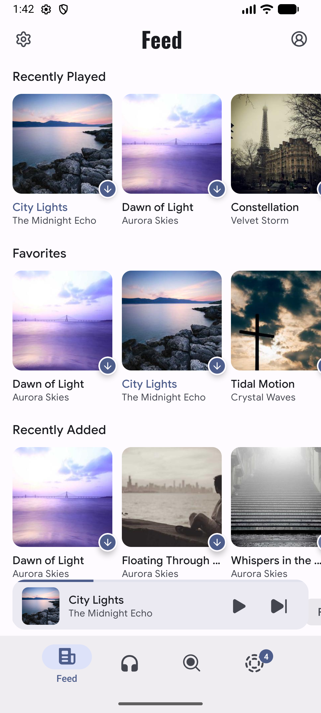 | 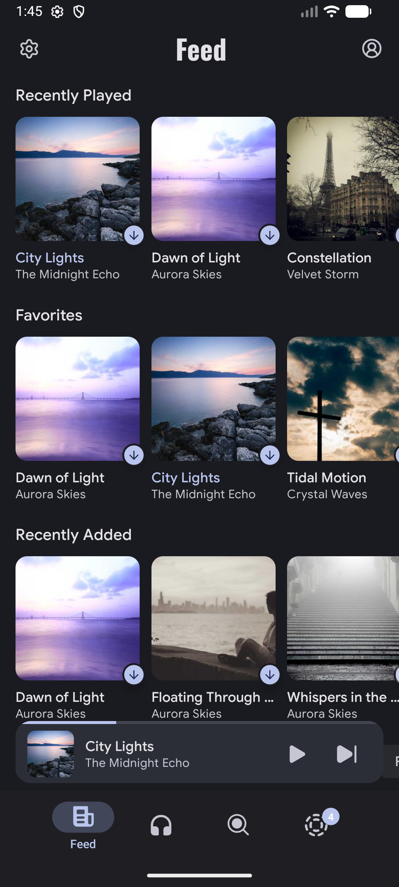 | Feed (landing screen) |
| 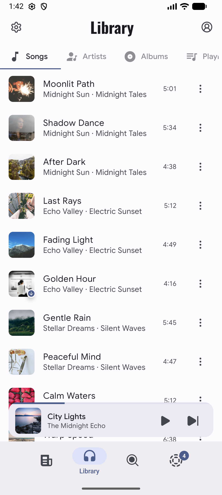 | 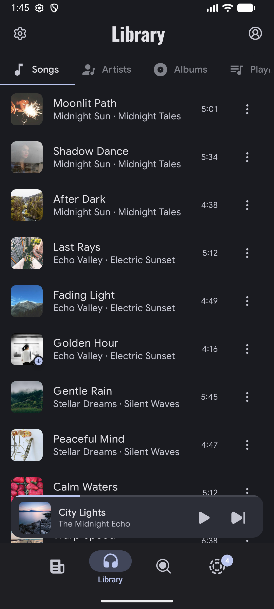 | Library - Songs tab |
| 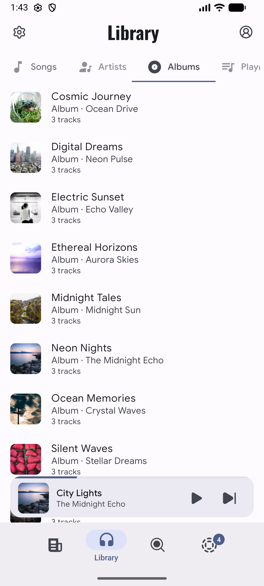 | 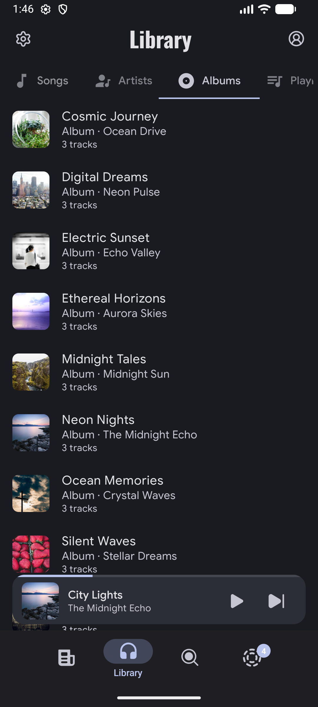 | Library - Albums tab |
| 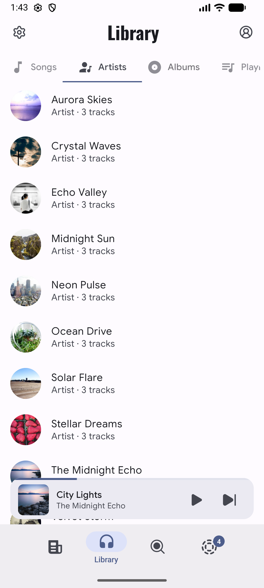 | 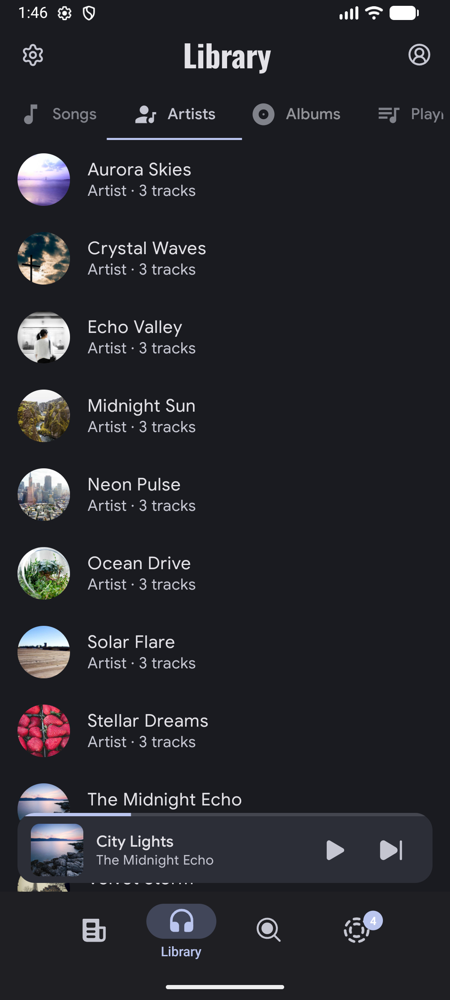 | Library - Artists tab |
| 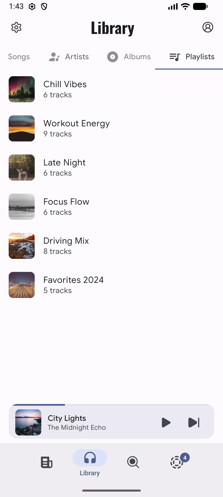 | 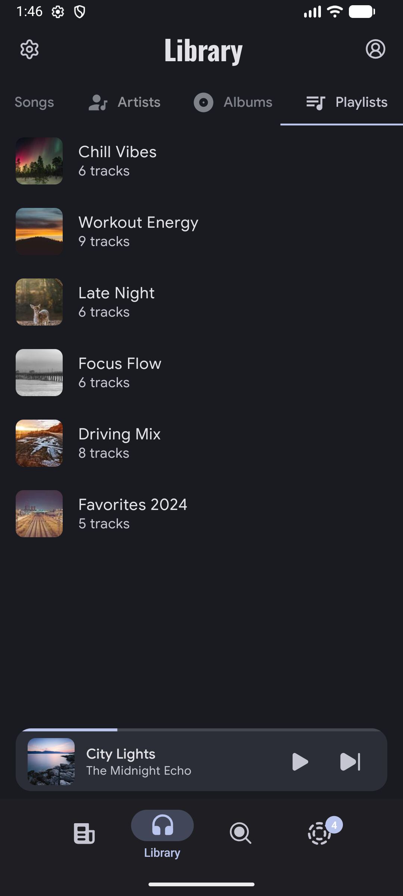 | Library - Playlists tab |
| 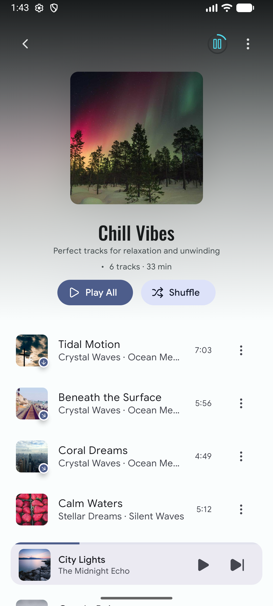 | 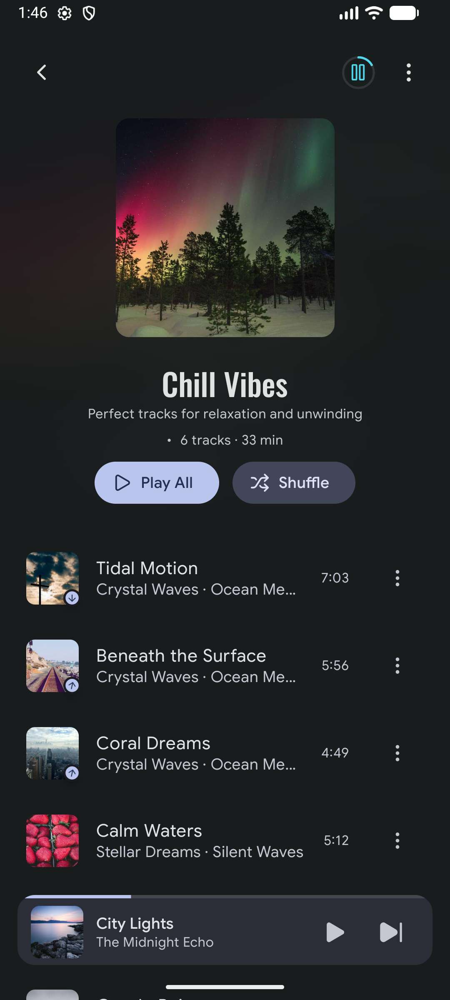 | Playlist detail view |
| 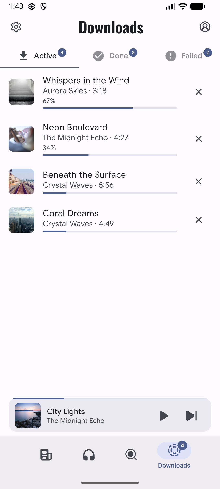 | 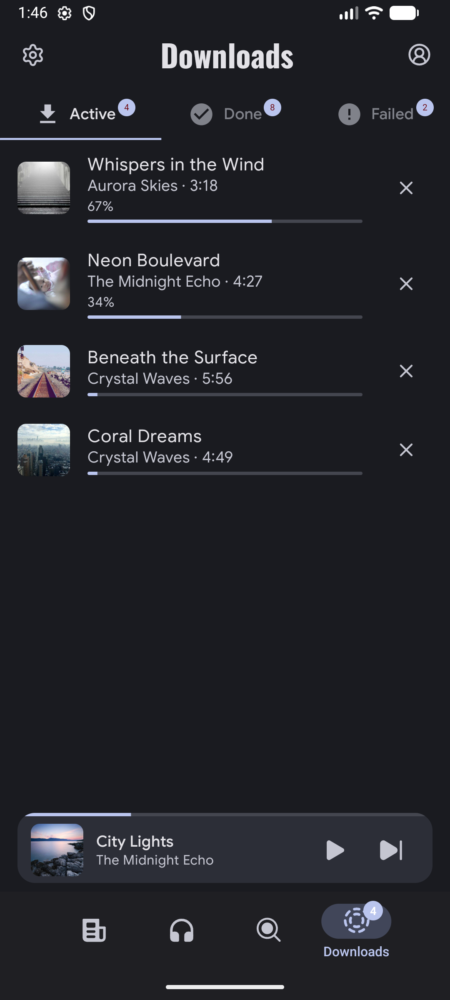 | Downloads screen |
| 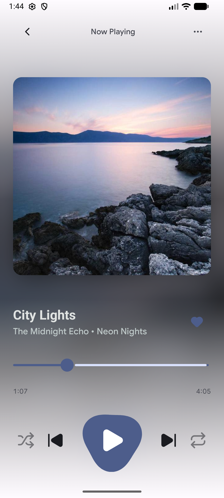 | 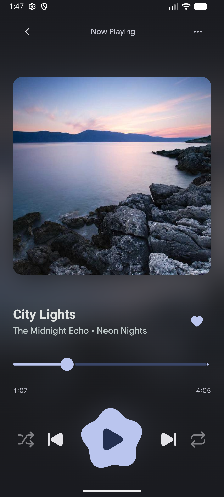 | Full-screen player |
| 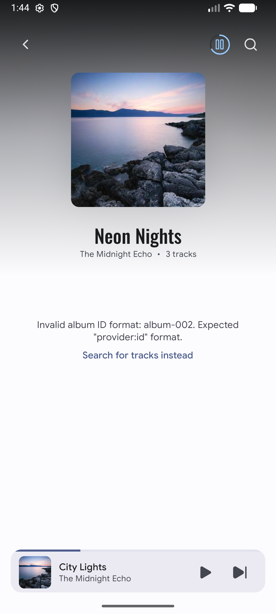 | 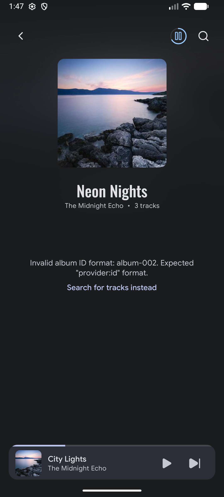 | Album detail view |
| 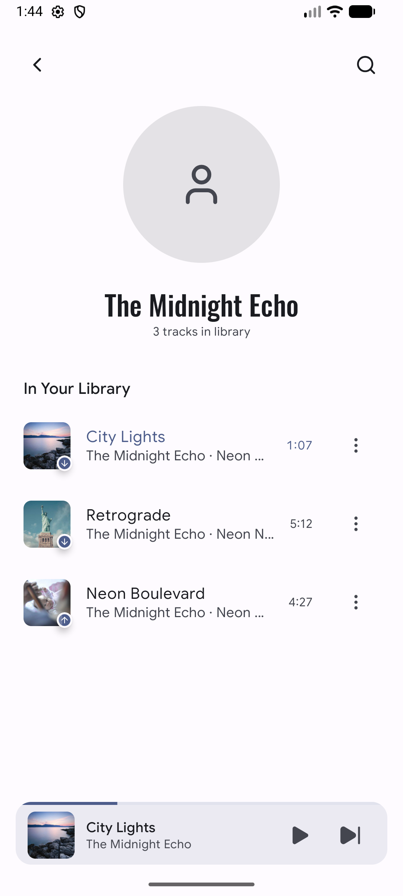 | 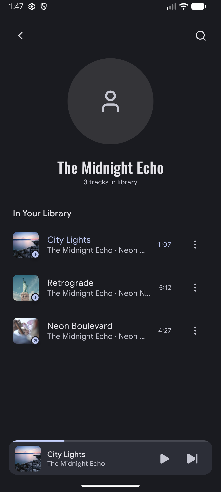 | Artist detail view |
| 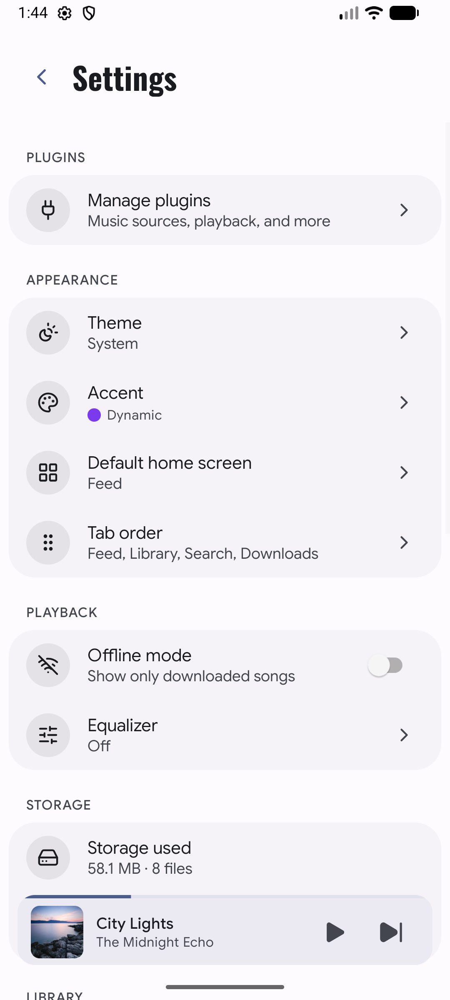 | 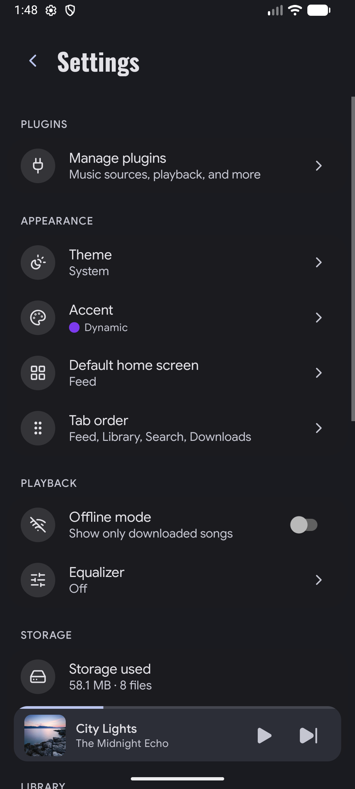 | Settings screen |

## How It Works

1. **Mock Data Loading**: The script navigates to Settings and enables "Screenshot Mode" which loads realistic mock data into the app
2. **Navigation**: Uses Maestro's declarative UI testing to navigate through screens
3. **Screenshots**: Captures each screen and saves to the fastlane directory
4. **Theme Switching**: Uses ADB to toggle system dark/light mode

## Troubleshooting

### "Maestro not found"

Install Maestro:

```bash
curl -Ls "https://get.maestro.mobile.dev" | bash
```

### "No Android device found"

Start an emulator:

```bash
emulator -avd <avd_name>
```

Or list available AVDs:

```bash
emulator -list-avds
```

### Screenshots look wrong

1. Ensure the app is freshly installed
2. Clear app data: `adb shell pm clear com.aria.music.app`
3. Re-run the screenshot script

### Maestro flow fails

Run Maestro Studio to debug:

```bash
maestro studio
```

## Customization

### Modifying the Flow

Edit `scripts/screenshots/screenshot-flow.yaml` to:

- Add new screens
- Change navigation paths
- Adjust wait times

### Adding New Screenshots

1. Add navigation step in `screenshot-flow.yaml`
2. Add `- takeScreenshot: "XX_screen_name"` command
3. Update this README with the new screenshot
